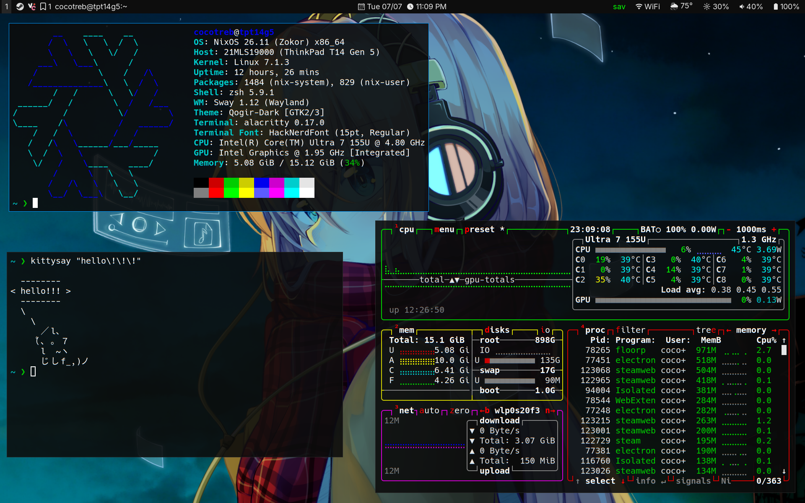

# Daily Driver Dotfiles
Very simplistic dotfiles for NixOS that roughly (and I really mean _roughly_) mimick the Windows 10 UI. Very functional while meeting a minimum aesthetic threshold, for me at least. Main WM is Sway but has Niri support. Bear in mind the Niri config has sway-like keybinds. This config is also ported to non-NixOS distros.

If you want to use these, remember to edit the wallpaper paths in wpaperd, swaylock, and the `swaybg -i` line in the main config.

## List of stuff that is imperatively added
- Kicad libraries
- PCSX2 games and saves
- Steam compatibility tools added with protonup-rs
- Settings and profiles in Waterfox

## Screenshot

## See also
[Wallpaper link](https://wallpaper-a-day.com/2016/06/24/) (remember to click on "1440p version")

[Swaylock wallpaper link](https://wallpaper-a-day.com/2025/12/11/22411/#respond)

[tdelamater1's dotfiles](https://github.com/tdelamater1/dots/tree/master) (thx for the weather waybar module)
