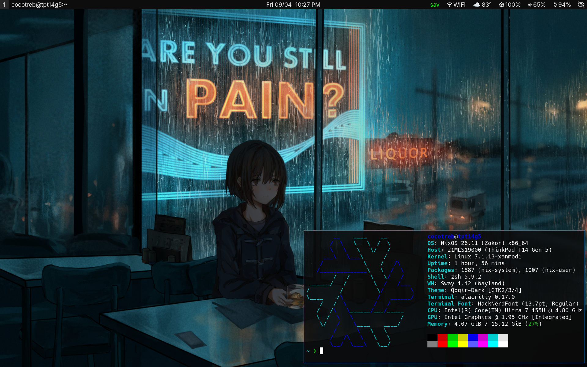

# Daily Driver Dotfiles
NixOS dotfiles for both gaming and development. Uses [Qogir](https://github.com/vinceliuice/Qogir-theme) GTK theme. Very functional while meeting a minimum aesthetic threshold, for me at least. Main WM is Sway but has Niri support. Bear in mind the Niri config has sway-like keybinds *and does not get updated*. This config is also ported to non-NixOS distros.

If you want to use these, remember to edit the wallpaper paths in wpaperd, swaylock, and the swaywm config as you will get errors if you don't update them yourself.

## List of stuff that is imperatively added
- Kicad libraries
- PCSX2 games and saves
- Steam compatibility tools added with protonup-rs
- Settings and profiles in Helium

## Screenshot

## See also

[Current wallpaper](https://wallhaven.cc/w/r2qqlj)

[tdelamater1's dotfiles](https://github.com/tdelamater1/dots/tree/master) (thx for the weather waybar module)

**Old wallpaper links**

[Moraine lake](https://4kwallpapers.com/nature/moraine-lake-landscape-sunrise-mountains-54.html)

[Moonrise rolling](https://4kwallpapers.com/nature/moonrise-rolling-25877.html)

[Megurine Luka](https://wallpaper-a-day.com/2016/06/24/) (remember to click on "1440p version")

[Hatsune Miku](https://wallpaper-a-day.com/2025/12/11/22411/#respond)

